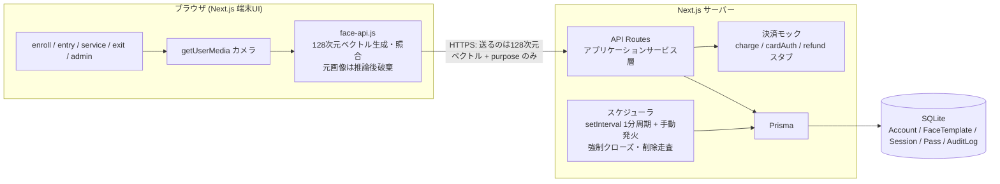
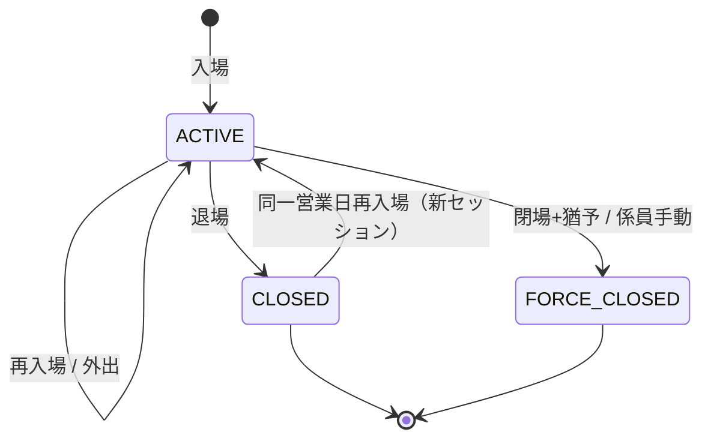
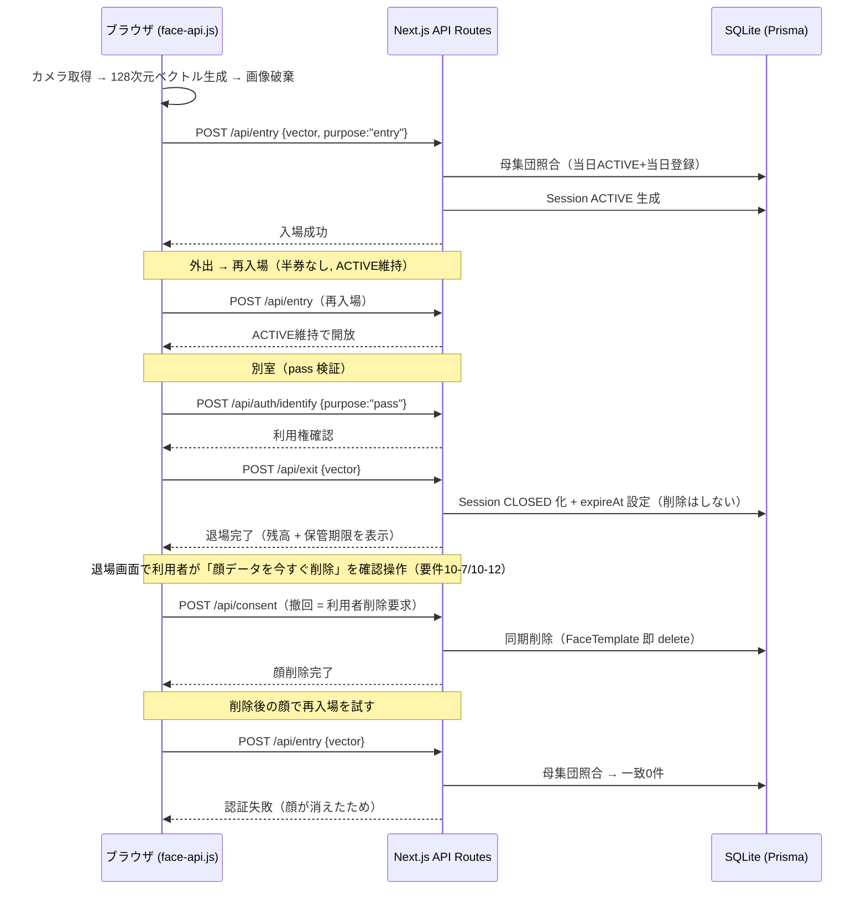

# Design Document

## Overview

顔認証による温泉入場・前払い決済システムの技術設計。要件定義（requirements.md 全14要件）を、今回はローカル環境で完結する MVP として実装する。AWS 連携（Rekognition / DynamoDB / EventBridge）は将来構想として設計末尾に分離し、本文の実装対象から外す。6時間のハッカソンMVP、coding agent 実装前提。中核の主張は「顔＝鍵で、各口の対面判断が消える」こと。

### ローカル完結への転換で解消したリスク（敵対的監査より）

| 監査で挙がった致命的指摘 | ローカル化による解消 |
| --- | --- |
| 要件11-4 越境移転の矛盾（Rekognition=米国基盤） | 顔処理がブラウザ内で完結。データが端末外に出ない。矛盾消滅 |
| Amplify SSR の IAM 沼 | AWS を使わない。素の Next.js を next dev/start で起動 |
| Rekognition レイテンシで2秒超過 | ネットワーク往復ゼロ。ブラウザ内推論のみ |
| TTL 48h遅延で「24h以内削除」違反 | 同期削除に一本化。遅延なし |

### 監査で生き残った本質的指摘（本設計に反映）

1. 削除は同期実行（削除操作で即座にテンプレート消去。退場は保管期限 `expireAt` の設定のみで、退場自体では消さない。要件10-1/10-2の保管期間を潰さないため）
2. 残高ACIDは実装必須（二重減算防止・整合。要件5-6, 5-9）
3. デモ背骨を体験主役に組み替え: 入場 → 外出 → 再入場（半券なし）→ 別室も顔だけ → 退場 → 退場画面で利用者自身が顔を消す（その顔で再入場を試すと失敗）
4. 「消えるのは元画像＋テンプレート」と主語を正確に

### 技術スタック（ローカル完結）

- フロント/サーバー: Next.js (App Router)。UI + API Routes
- 顔検出・埋め込み: face-api.js (TensorFlow.js)。ブラウザ内で128次元ベクトル生成・1:N照合。データが端末外に出ないため要件11の根幹を最も素直に満たす。128次元埋め込みのユークリッド距離比較が要件13の符号化・照合と対応。レイテンシは推論のみ、ネットワーク不要
- データストア: SQLite + Prisma。3層分離をテーブル分割で表現
- スケジュール処理: Next.js サーバー内 setInterval + 手動発火ボタン（強制クローズ 要件8-6、削除走査 要件10-5）
- 決済: モック関数（チャージ・カード・返金を即成功で返す）

### 顔ベクトルの置き場所（設計判断）

- 方式A（最も安全）: ベクトルもブラウザ内IndexedDBに保持し照合もブラウザ。サーバーにはaccountIdと照合結果のみ。データが端末外に一切出ない
- 方式B（実装容易）: ベクトルをSQLite FaceTemplatesに保存しサーバー側で距離計算
- MVPは方式Bで実装、方式Aを将来構想に記載。ただし元画像は方式問わずサーバーへ送らない

## Architecture

ブラウザ（Next.js端末UI: enroll/entry/service/exit/admin、getUserMediaでカメラ、face-api.jsで128次元ベクトル生成、元画像は推論後破棄）→ HTTPS（送るのは128次元ベクトルとpurposeのみ）→ Next.js API Routes（アプリケーションサービス層）→ Prisma → SQLite（Account/FaceTemplate/Session/Pass/AuditLog）。サーバー内スケジューラ（setInterval デモ1分周期 + 手動発火）で強制クローズ・削除走査。決済モックは charge/cardAuth/refund スタブ。

### コンポーネントと要件サービスの対応

| コンポーネント | 実装 |
| --- | --- |
| Auth_Service | API Route /api/auth/identify + face-api.js照合（ユークリッド距離） |
| Session_Service | API + Session |
| Account_Service | API + Account（Prisma $transaction） |
| Template_Store | FaceTemplate（SQLite） |
| Retention_Service | setInterval + 同期削除 |
| Consent_Service | API + Account consent属性 |
| Template_Codec | 128次元ベクトルのJSON符号化（face-api.js出力の永続化形式） |
| Admin_Console | Next.js管理画面 + Prismaクエリ |

## Components and Interfaces

各APIの入出力を記述。

- **Auth_Service /api/auth/identify**: 入力 `{vector:number[128], purpose:"entry"|"payment"|"pass"}`。purpose検証（3値以外400、要件11-2/11-3）。母集団構築（当日ACTIVE+当日登録、上限500、要件3-2/5-1）。各FaceTemplate（1アカウント最大5件）とユークリッド距離、アカウント単位で最小距離採用（要件9-5）。閾値0.5未満の件数で matched(1件)/none(0件)/ambiguous(2件以上)判定（要件3-6/3-7/5-5/5-7）。アクセスをAuditLog追記（ベクトル値記録しない、要件11-10）。出力 `{result, accountId?, score?}`
- **Session_Service /api/entry /api/exit**: entryはidentify成功+当日有効な入浴券でSession ACTIVE生成、既ACTIVEなら維持し開放（要件3-9/4-1）、通過履歴追記（要件4-3）。exitはACTIVEをCLOSEDに更新し退場時刻記録、FaceTemplate.expireAt=退場時刻+retentionDays設定（要件8-1/8-2）。退場時の残高表示は要件8-3スコープ外
- **入浴券（要件3-8/4-4/4-7）**: `Pass`（=利用権。用語定義上「入浴以外の有料権利」）とは別概念のため流用しない。専用テーブルを持たず `AuditLog` を追記専用の入場権台帳として用いる。当日有効な入浴券の有無 = 当該アカウントの当日 `eventType="BATH_TICKET_ISSUED"` エントリの存在。発行は A所有の `POST /api/entry/ticket`（券売機での購入相当）。登録（`/api/enroll`）では自動発行しない。登録済みかつ券なしの状態を作れることで要件3-8の拒否分岐が到達可能になる
- **Account_Service /api/pay ほか**: 残高減算はPrisma $transactionで残高チェック→減算→取引記録を原子的に（要件5-2/5-9）。冪等キー=(terminal,amount,sessionId,時刻窓)で重複要求に最初の結果（要件5-6）。残高0〜50000円制約（要件6-5）
- **Retention_Service**: 同期削除（本体）=同意撤回・利用者削除要求の時点で該当FaceTemplate即delete（要件10-7）。**退場は削除の契機ではない**。退場時は `expireAt=退場時刻+retentionDays` を設定するだけで（要件8-2）、削除は期限到来か利用者要求のいずれかで起きる。退場即削除にすると保管期間（要件10-1: 既定7日 / 10-2: 顧客指定1〜90日）が常に0日になり要件を満たせないため。走査（保険）=setInterval デモ1分周期でexpireAt<=nowを即削除（要件10-4/10-5）。ACTIVE保持中の削除要求はセッション終了まで延期（要件10-8）。延期は削除要求時に `expireAt=now` を書き、走査側でACTIVE保持アカウントをスキップする形で実現し、専用フラグは設けない
- **Consent_Service /api/consent**: 登録同意・決済同意を独立2項目記録（要件1-4）、撤回時は同期削除で「顔を消す→同じ顔で入場失敗」を実演可能に（要件1-12/10-7）。デモ背骨の「顔が消える」はこの経路。退場画面から確認操作つきで呼ぶ（要件10-12）
- **Admin_Console /api/admin**: ACTIVEセッション一覧・件数、監査ログ一覧、強制クローズ手動発火（要件14）

## Data Models

SQLite+Prisma。5テーブルを表で定義。

- **Account（永続層）**: id(PK), balance(Int 0-50000), cardToken(String?), retentionDays(Int default7 1-90), consentEnrollment(Bool), consentPayment(Bool), consentTs(DateTime?), consentVersion(String?), autoChargeEnabled(Bool), autoChargeAmount(Int?)。relation passes/sessions/faceTemplates
- **FaceTemplate（テンプレート層）**: id(PK), accountId(FK), vector(Json 128次元), modelVersion(String), createdAt(DateTime), expireAt(DateTime?)。1アカウント最大5件（要件9-3/9-4）。元画像保存しない（要件1-7）
- **Session（滞在層）**: id(PK), accountId(FK), state(Enum ACTIVE/CLOSED/FORCE_CLOSED), enteredAt, exitedAt(?), passHistory(Json), transactions(Json)
- **Pass（利用権）**: id(PK), accountId(FK), expiresAt(営業日終了), status(Enum VALID/EXPIRED)。アカウント紐づけ（要件7-6）
- **AuditLog（監査層・追記専用）**: id(ULID PK), ts, eventType, accountId(?), detail(Json)。update/delete API設けず追記のみ（要件14-4）。ベクトル値記録しない（要件11-10/14-4）

状態遷移図:

デモ背骨のシーケンス図:

## Correctness Properties

*A property is a characteristic or behavior that should hold true across all valid executions of a system-essentially, a formal statement about what the system should do. Properties serve as the bridge between human-readable specifications and machine-verifiable correctness guarantees.*

以下12プロパティを *For any* 形式で記述し、各に **Validates: Requirements X** を付す。

### Property 1: 同意項目の独立記録

*For any* 登録同意と決済同意の全組み合わせについて、各値が入力どおり保持され互いに影響しない。

**Validates: Requirements 1.4**

### Property 2: 1:N識別の件数判定整合

*For any* 母集団と入力ベクトルについて、閾値未満の件数と none / matched / ambiguous の判定が厳密に対応する。

**Validates: Requirements 3.4, 3.6, 3.7, 5.5, 5.7**

### Property 3: 残高減算の原子性

*For any* 残高と支払い金額について、成功時のみちょうど金額分減算＋取引1件が記録され、失敗時は残高不変・取引0件となる。

**Validates: Requirements 5.2, 5.9**

### Property 4: 支払いの冪等性

*For any* 同一冪等キーの支払い要求を任意回数受けても、正味減算は1回・取引は1件で、2回目以降は最初の結果を返す。

**Validates: Requirements 5.6**

### Property 5: 残高の範囲不変

*For any* 操作列について、残高は常に0〜50000の範囲に収まり、超過支払いは減算も立替もしない。

**Validates: Requirements 6.5**

### Property 6: テンプレート符号化のラウンドトリップ順方向

*For any* 128次元テンプレートについて、encode→decode で全要素値とバージョンが誤差なく一致する。

**Validates: Requirements 13.3**

### Property 7: 永続化形式のラウンドトリップ逆方向

*For any* 1〜65536バイトの有効データについて、decode→encode でバイト列が完全一致する。

**Validates: Requirements 13.4**

### Property 8: エンコードの決定性

*For any* テンプレートについて、複数回 encode してもバイト列が一致する。

**Validates: Requirements 13.5**

### Property 9: 不正な永続化形式の拒否

*For any* 不正な永続化形式（0バイト / 65536超 / バージョン欠落 / 構造不適合）について、エラーとなりテンプレートを返さない。

**Validates: Requirements 13.6**

### Property 10: 利用権判定の冪等

*For any* 有効期間内の利用権について、任意回数判定しても全て許可される。

**Validates: Requirements 7.3**

### Property 11: 退場によるセッション遷移

*For any* ACTIVE セッションについて、退場を適用すると CLOSED になり退場時刻が記録される。

**Validates: Requirements 8.1**

### Property 12: 削除後の照合不成立

*For any* 同期削除後のアカウントについて、削除で用いたベクトルで identify しても当該アカウントに一致しない。

**Validates: Requirements 10.4, 10.7**

## Error Handling

| 事象 | 要件 | 挙動 |
| --- | --- | --- |
| 顔特徴量算出不可 | 1-9, 1-10, 9-9 | 再撮影最大3回、3回失敗で中止・破棄・係員案内 |
| テンプレート保管失敗 | 1-11, 9-4 | ロールバック |
| 識別0件 | 3-6, 5-5 | none として認証失敗を返す |
| 識別2件以上 | 3-7, 5-7 | ambiguous として拒否 |
| identifyタイムアウト | 3-11 | タイムアウトエラー返却 |
| 残高減算途中失敗 | 5-9 | $transaction ロールバック |
| 残高不足 | 6-1〜6-9 | チャージ提示 |
| 目的外照合要求 | 11-2, 11-3 | 拒否（400） |
| 削除処理失敗 | 10-10 | 最大3回再試行 |
| 強制クローズ更新失敗 | 8-9 | 再試行・記録 |
| 監査記録失敗 | 14-9 | 記録・アラート |
| 決済モック | 2, 6, 12 | 即成功で返す |

加えて、元画像破棄・目的限定・監査（ベクトル値記録しない）の方針を全経路で徹底する。

## Testing Strategy

二本立て（ユニット＋プロパティ）。

- **プロパティテスト**: PBTライブラリは fast-check、最低100反復（`{numRuns:100}`）、タグ形式 `Feature: face-auth-onsen-entry, Property N: ...`。各Correctness Propertyは単一のPBTで実装（Property 1〜12 に12本）。ジェネレータ方針: 128次元ベクトル、母集団件数・距離ランダム化、残高・金額0〜50000。
- **ユニット/その他**: PBTを用いない部分は、決済モック=INTEGRATION、UI=EXAMPLE、タイミング要件はネットワーク往復なしで構造的に満たす見込み。

## 将来構想（今回スコープ外・AWS連携）

| 項目 | 今回（ローカル） | 将来（AWS連携） |
| --- | --- | --- |
| 顔識別 | face-api.js | Rekognition（越境は国内リージョン+学習オプトアウト or 国内ベンダー） |
| ベクトル配置 | 方式B | 方式A |
| ストア | SQLite | DynamoDB（TTLは保険、削除本体は能動的） |
| スケジュール | setInterval | EventBridge + Lambda |
| ホスティング | ローカル | EC2 / ECS |
| 本人確認 | 簡易PIN | Cognito |
| 監査改ざん耐性 | アプリ層追記 | QLDB相当 |

## 割り切りとリスク（MVP前提）

- face-api.jsモデルロード初回数秒 → 起動時プリロード + ダミー推論でウォームアップ
- 母集団はデモで登録者3〜5名固定し1:N単純化
- 監査ログ改ざん耐性はアプリ層追記限定（ローカルSQLite、将来QLDB相当）
- 方式B採用のため「ベクトルが端末外に出ない」は完全には満たさない。方式Aを将来構想に明記
- 要件8-3（退場ゲートで残高を10秒以上表示）はスコープ外。凍結済みの `ExitResponse` に `balance` がなく、`AccountAction` にも残高読み取り操作がないため、凍結解除なしでは実現経路がない。退場は `released` / `sessionState` / `exitedAt` の表示のみとする
- 入浴券（要件3-8/4-4/4-7）は専用テーブルを持たない。`Pass` は用語定義上「入浴以外の有料権利」であり流用できないため、`AuditLog` を追記専用の入場権台帳として用いる（`eventType="BATH_TICKET_ISSUED"`）。判定・発行は `src/lib/auth/bathTicket.ts` に隠蔽し、将来テーブル化する際は同ファイルの差し替えのみで済む形にする

## MVP スコープ表

| 区分 | 内容 |
| --- | --- |
| 実装（背骨） | 登録+同意(1) / 入場1:N識別(3) / 再入場(4) / 施設内決済(5) / 退場=expireAt設定(8) / 利用者要求による同期削除+期限走査(10) / 別室利用権(7) |
| 実装（必須・監査指摘） | 残高ACID・二重減算防止(5-6, 5-9) |
| 一部実装 | 残高不足→チャージ提示(6) / 認証失敗→再登録誘導(9) / 監査一覧(14) |
| モック | 決済事業者連携(2 チャージ・カード, 6 カード決済, 12 返金) |
| 後回し（可逆） | 本人確認(9, 11, 12 は簡易PIN) / 残高払い出しUI(12) / 退場ゲートでの残高表示(8-3) |
| 設計のみ | 目的別アクセス制御の厳密化(11) / 監査ログ改ざん耐性強化(14) |
