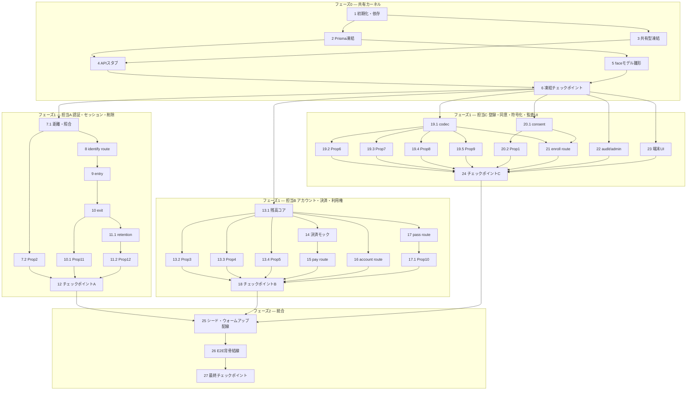

# Implementation Plan: 顔認証温泉入場・前払い決済システム

## Overview

本実装計画は、design.md と requirements.md をローカル完結（Next.js App Router + Prisma + SQLite + ブラウザ内 face-api.js）で実装するための、coding-agent 向けタスク列である。

言語: TypeScript（Next.js）。PBT ライブラリは fast-check。

チーム前提: 3人が各自 coding agent（AIDD）で並行実装する。同じファイルを2人が編集する状況を構造的に禁止する。
1. フェーズ0（共有カーネル）を1人が担当し、他2人はブロックされる。全員が依存する土台（Prismaスキーマ・共有型・API Routeの型契約スタブ）を確定・凍結する。フェーズ0完了が全並行タスクの前提。
2. フェーズ1以降は担当A/B/Cが所有ディレクトリで並行し、相互に非競合。各担当は自分の所有ディレクトリ配下のみを編集する。
3. src/types/ と prisma/schema.prisma は凍結後、原則変更禁止。変更はフェーズ0担当に一元依頼する。
4. UI（src/app/(terminals)/）は担当C所有。画面が叩くAPIは担当A/Bの所有だが、結合はフェーズ0で凍結した型契約を介するため競合しない。

担当と所有範囲の対応表:
- 共有（カーネル）: prisma/, src/types/, 各APIルートスタブ, src/lib/face/（モデルロード雛形）。全般の土台
- A（認証・セッション・削除）: src/app/api/auth/, src/app/api/entry/, src/app/api/exit/, src/lib/auth/, src/lib/retention/。要件3,4,8,10。Property 2,11,12
- B（アカウント・決済・利用権）: src/app/api/pay/, src/app/api/pass/, src/app/api/account/, src/lib/account/, src/lib/payment-mock/。要件2,5,6,7,12。Property 3,4,5,10
- C（登録・同意・符号化・監査UI）: src/app/api/enroll/, src/app/api/consent/, src/app/api/admin/, src/app/(terminals)/, src/lib/codec/, src/lib/consent/, src/lib/audit/。要件1,9,11,13,14。Property 1,6,7,8,9

MVP前提: design の MVP スコープ表に従う。「後回し（可逆）」「設計のみ」は実装タスクに含めない（末尾に optional として最小限のみ分離）。決済事業者連携はモック。

プロパティテスト方針: fast-check、最低100反復（{ numRuns: 100 }）、各テストにタグコメント `Feature: face-auth-onsen-entry, Property N: ...` を付す。Property 1〜12 に対して各1本。

## Tasks

### フェーズ0 — 共有カーネル（担当: 共有／リード1人。完了まで A/B/C はブロック）

- [x] 1. プロジェクト初期化と依存導入 【担当: 共有】
  - create-next-app（App Router, TypeScript）で LE_hackathon 直下に Next.js プロジェクトを初期化
  - 依存導入: face-api.js, @prisma/client, prisma(dev), fast-check(dev), vitest(dev), @vitejs/plugin-react(dev), ulid
  - vitest.config.ts 作成、package.json に test(vitest --run) と db:migrate(prisma migrate dev) スクリプト追加
  - 所有ファイル: package.json, vitest.config.ts, tsconfig.json, next.config.js
  - 完了条件: npm run test が0件でも正常終了し npx prisma -v が動作
  - _Requirements: 全体基盤_

- [x] 2. Prisma スキーマ確定・migrate・SQLite 初期化 【担当: 共有】（凍結対象）
  - prisma/schema.prisma に5テーブル定義: Account / FaceTemplate / Session / Pass / AuditLog（design の Data Models どおり）
  - datasource を SQLite（file:./dev.db）に設定し prisma migrate dev --name init、prisma generate
  - 所有ファイル: prisma/schema.prisma, prisma/migrations/
  - 凍結ルール: 完了後 prisma/schema.prisma は原則変更禁止。変更はフェーズ0担当に依頼
  - 完了条件: dev.db が生成され5テーブルが存在
  - _Requirements: 2.8, 8.2, 9.3, 10.9, 14.4_

- [x] 3. 共有型定義の確定 【担当: 共有】（凍結対象）
  - src/types/vector.ts（FaceVector=number[], VECTOR_DIM=128, ModelVersion）
  - src/types/purpose.ts（Purpose="entry"|"payment"|"pass"）
  - src/types/session.ts（SessionState="ACTIVE"|"CLOSED"|"FORCE_CLOSED"）
  - src/types/api.ts（全APIのリクエスト/レスポンス型を export、design の Components and Interfaces に厳密対応）
  - src/types/codec.ts（永続化形式データ型、境界長1〜65536バイト）
  - 所有ファイル: src/types/ 配下すべて
  - 凍結ルール: 完了後 src/types/ は原則変更禁止
  - 完了条件: tsc --noEmit が通る
  - _Requirements: 3.4, 5.2, 11.2, 13.2, 13.8_

- [x] 4. 全 API Route の型契約スタブ生成 【担当: 共有】
  - 各 route ファイルを作成し入出力型を用いてハンドラ署名を確定、中身は HTTP 501 を返す
  - 作成: src/app/api/auth/identify/route.ts, enroll, entry, exit, pay, pass, account, consent, admin
  - 各 route 先頭に担当（A/B/C）コメント
  - 完了条件: 各エンドポイントで501が返る
  - _Requirements: 3.3, 5.1, 11.2_

- [x] 5. face-api.js モデルプリロード/ウォームアップ雛形 【担当: 共有】
  - src/lib/face/loadModels.ts（TinyFaceDetector+FaceLandmark68+FaceRecognition、public/models/）
  - src/lib/face/warmup.ts（ダミー推論で初回遅延回避）
  - src/lib/face/detect.ts（カメラ画像から128次元descriptor抽出し元画像バッファ破棄、要件1-7/11-4）
  - 所有ファイル: src/lib/face/ 配下
  - 完了条件: モデルロード関数が import 可能で型が通る
  - _Requirements: 1.6, 1.7, 11.4_

- [x] 6. チェックポイント — フェーズ0凍結 【担当: 共有】
  - 全テストと tsc --noEmit が通ることを確認。問題があれば利用者に確認
  - src/types/ と prisma/schema.prisma の凍結を宣言し A/B/C へ着手通知

### フェーズ1 — 担当A: 認証・セッション・削除（デモ背骨の中核）

- [ ] 7. Auth_Service コアロジック実装 【担当: A / src/lib/auth/】
  - [ ] 7.1 ユークリッド距離・母集団照合ロジック
    - src/lib/auth/distance.ts（128次元ユークリッド距離）, src/lib/auth/identify.ts（母集団 当日ACTIVE+当日登録 上限500、最小距離採用、閾値0.5未満件数で matched/none/ambiguous、purpose検証）
    - _Requirements: 3.2, 3.4, 3.6, 3.7, 5.1, 5.5, 5.7, 9.5, 11.2_
  - [ ]* 7.2 Property 2: 1:N識別の件数判定整合
    - **Validates: Requirements 3.4, 3.6, 3.7, 5.5, 5.7**
    - src/lib/auth/identify.property.test.ts、fast-check {numRuns:100}、タグ付与

- [ ] 8. /api/auth/identify ルート実装 【担当: A / src/app/api/auth/identify/route.ts】
  - スタブの中身を実装、identify.ts を呼び {result,accountId?,score?} を返す。AuditLog追記（ベクトル値記録しない）は担当Cの src/lib/audit/ を型契約経由で呼ぶ
  - _Requirements: 3.1, 3.3, 3.11, 5.1, 11.2, 11.10_

- [ ] 9. Session_Service（入場）実装 【担当: A / src/app/api/entry/route.ts】
  - identify成功+当日有効入浴券でSession ACTIVE生成、既ACTIVEなら維持し開放、通過履歴昇順追記、CLOSED/FORCE_CLOSED後は入浴券判定で新セッション、各失敗分岐でセッション非生成
  - _Requirements: 3.4, 3.5, 3.6, 3.7, 3.8, 3.9, 3.11, 4.1, 4.2, 4.3, 4.4, 4.6, 4.7_

- [ ] 10. Session_Service（退場）実装 【担当: A / src/app/api/exit/route.ts】
  - ACTIVEをCLOSEDに更新し退場時刻記録、FaceTemplate.expireAt=退場時刻+retentionDays、ACTIVEでないアカウントの退場は不整合を監査記録・開放
  - _Requirements: 8.1, 8.2, 8.3, 8.4_
  - [ ]* 10.1 Property 11: 退場によるセッション遷移
    - **Validates: Requirements 8.1**
    - src/lib/auth/exit.property.test.ts、fast-check {numRuns:100}、タグ付与

- [ ] 11. Retention_Service（同期削除・走査）実装 【担当: A / src/lib/retention/】
  - [ ] 11.1 同期削除と走査ロジック
    - src/lib/retention/deleteTemplate.ts（同意撤回・利用者削除要求で即delete。**退場は契機に含めない**。退場はタスク10の expireAt 設定のみ）, src/lib/retention/computeExpireAt.ts（退場時刻+retentionDays。CLOSED/FORCE_CLOSED両経路から呼べるよう公開）, src/lib/retention/scanner.ts（setInterval 1分周期+手動発火で expireAt<=now を即削除）、ACTIVE保持中は延期（削除要求時に expireAt=now を書き、走査側でACTIVE保持アカウントをスキップ。専用フラグは設けない）、削除をAuditLog記録（内容記録しない）
    - _Requirements: 10.4, 10.5, 10.6, 10.7, 10.8, 10.11_
  - [ ]* 11.2 Property 12: 削除後の照合不成立
    - **Validates: Requirements 10.4, 10.7**
    - src/lib/retention/deleteTemplate.property.test.ts、fast-check {numRuns:100}、タグ付与

- [ ] 12. チェックポイント（担当A）
  - 担当A範囲の全テストと tsc --noEmit が通ることを確認。問題があれば利用者に確認

### フェーズ1 — 担当B: アカウント・決済・利用権（前払いとACID）

- [ ] 13. Account_Service 残高操作コア実装 【担当: B / src/lib/account/】
  - [ ] 13.1 Prisma $transaction 残高減算と冪等キー
    - src/lib/account/charge.ts（$transactionで残高チェック→減算→取引記録、途中失敗ロールバック）, idempotency.ts（冪等キー terminal+amount+sessionId+時刻窓60秒）, balance.ts（0〜50000円制約）
    - _Requirements: 5.2, 5.6, 5.9, 6.5, 6.7_
  - [ ]* 13.2 Property 3: 残高減算の原子性
    - **Validates: Requirements 5.2, 5.9**
    - src/lib/account/charge.property.test.ts、fast-check {numRuns:100}、タグ付与
  - [ ]* 13.3 Property 4: 支払いの冪等性
    - **Validates: Requirements 5.6**
    - src/lib/account/idempotency.property.test.ts、fast-check {numRuns:100}、タグ付与
  - [ ]* 13.4 Property 5: 残高の範囲不変
    - **Validates: Requirements 6.5**
    - src/lib/account/balance.property.test.ts、fast-check {numRuns:100}、タグ付与

- [ ] 14. 決済モック実装 【担当: B / src/lib/payment-mock/】
  - src/lib/payment-mock/gateway.ts（charge/cardAuth/refund を成功失敗切替、タイムアウト・拒否・返金失敗切替）
  - _Requirements: 2.2, 2.3, 2.5, 6.2, 6.6, 6.8, 12.8_

- [ ] 15. /api/pay ルート実装 【担当: B / src/app/api/pay/route.ts】
  - identify結果を型契約経由で受け、1件一致かつ残高十分なら charge.ts で減算・取引記録。0件/2件/残高不足分岐、チャージ提示・オートチャージ
  - _Requirements: 5.2, 5.3, 5.4, 5.5, 5.6, 5.7, 5.8, 5.9, 6.1, 6.2, 6.3, 6.4, 6.6, 6.9_

- [ ] 16. /api/account ルート実装（生成・チャージ・払い出し） 【担当: B / src/app/api/account/route.ts】
  - 新規生成（残高0初期化）、チャージ（1000〜30000・上限50000）、カードトークン保存、テンプレート削除後もアカウント保持、払い出し（返金失敗時に残高復元）
  - _Requirements: 2.1, 2.2, 2.4, 2.5, 2.7, 2.9, 10.9, 12.2, 12.5, 12.6, 12.8_

- [ ] 17. /api/pass ルート実装（利用権発行・検証） 【担当: B / src/app/api/pass/route.ts】
  - 発行（有効期間=営業日終了、アカウント紐づけ）、別室有効性判定（回数無制限）、既存有効利用権あれば新規発行しない、期限経過で失効記録
  - _Requirements: 7.1, 7.2, 7.3, 7.5, 7.6, 7.7_
  - [ ]* 17.1 Property 10: 利用権判定の冪等
    - **Validates: Requirements 7.3**
    - src/lib/account/pass.property.test.ts、fast-check {numRuns:100}、タグ付与

- [ ] 18. チェックポイント（担当B）
  - 担当B範囲の全テストと tsc --noEmit が通ることを確認。問題があれば利用者に確認

### フェーズ1 — 担当C: 登録・同意・符号化・監査UI

- [ ] 19. Template_Codec 実装 【担当: C / src/lib/codec/】
  - [ ] 19.1 128次元ベクトルの符号化・復号
    - src/lib/codec/encode.ts（128次元+modelVersion をJSONへ、バージョン識別子を復元可能に含める、決定的）, decode.ts, validate.ts（0バイト/65536超/バージョン欠落/構造不適合を拒否）
    - _Requirements: 13.1, 13.2, 13.3, 13.6, 13.7, 13.8_
  - [ ]* 19.2 Property 6: 符号化ラウンドトリップ順方向
    - **Validates: Requirements 13.3**
    - src/lib/codec/roundtrip-forward.property.test.ts、fast-check {numRuns:100}、タグ付与
  - [ ]* 19.3 Property 7: 永続化形式ラウンドトリップ逆方向
    - **Validates: Requirements 13.4**
    - src/lib/codec/roundtrip-backward.property.test.ts、fast-check {numRuns:100}、タグ付与
  - [ ]* 19.4 Property 8: エンコードの決定性
    - **Validates: Requirements 13.5**
    - src/lib/codec/deterministic.property.test.ts、fast-check {numRuns:100}、タグ付与
  - [ ]* 19.5 Property 9: 不正な永続化形式の拒否
    - **Validates: Requirements 13.6**
    - src/lib/codec/reject-invalid.property.test.ts、fast-check {numRuns:100}、タグ付与

- [ ] 20. Consent_Service 実装 【担当: C / src/lib/consent/, src/app/api/consent/route.ts】
  - [ ] 20.1 同意記録・撤回ロジック
    - src/lib/consent/record.ts（登録同意・決済同意を独立2項目、同意日時秒・バージョン記録）, revoke.ts（撤回記録+担当Aの deleteTemplate.ts を型契約経由で同期削除）, /api/consent/route.ts 実装
    - _Requirements: 1.2, 1.4, 1.5, 1.12, 11.1_
  - [ ]* 20.2 Property 1: 同意項目の独立記録
    - **Validates: Requirements 1.4**
    - src/lib/consent/record.property.test.ts、fast-check {numRuns:100}、タグ付与

- [ ] 21. /api/enroll ルートと登録フロー実装 【担当: C / src/app/api/enroll/route.ts】
  - 同意記録→ブラウザから受領した128次元ベクトルを codec で符号化し FaceTemplate 保管。最大5件、6件目は最古削除、保管失敗時ロールバック、元画像非受領、再登録（本人確認後の追加）
  - _Requirements: 1.6, 1.7, 1.11, 9.1, 9.2, 9.3, 9.4, 9.7, 11.4_

- [ ] 22. Admin_Console と監査ログ実装 【担当: C / src/lib/audit/, src/app/api/admin/route.ts】
  - src/lib/audit/log.ts（追記専用、ULID・ベクトル値含めない、A/B/Cが型契約経由で共通利用）, /api/admin/route.ts（ACTIVE一覧・件数、監査ログ降順最大1000、強制クローズ手動発火、上限90%/到達警告、手動操作の監査記録）
  - _Requirements: 11.10, 14.1, 14.2, 14.3, 14.4, 14.5, 14.6, 14.7, 14.8, 14.9_

- [ ] 23. 端末UI画面の骨格実装 【担当: C / src/app/(terminals)/】
  - enroll/page.tsx（同意画面5項目表示、カメラ→ベクトル化→元画像破棄→/api/enroll）, entry/page.tsx, service/page.tsx（/api/pay,/api/pass）, exit/page.tsx（残高と保管期限を表示し、「顔データを今すぐ削除」を確認操作つきで提示→/api/consent 撤回。削除が取り消せないこと・再入場には再登録が必要なことを表示。要件10-12）, admin/page.tsx。API呼び出しは凍結型契約経由
  - 所有ファイル: src/app/(terminals)/ 配下すべて
  - _Requirements: 1.1, 3.1, 5.1, 7.2, 8.3, 11.1, 14.2_

- [ ] 24. チェックポイント（担当C）
  - 担当C範囲の全テストと tsc --noEmit が通ることを確認。問題があれば利用者に確認

### フェーズ2 — 統合（担当: リード1人 or 全員）

- [ ] 25. デモ用シードとウォームアップ配線 【担当: 統合 / prisma/seed.ts, src/lib/face/】
  - prisma/seed.ts（母集団3〜5名固定シード）, 起動時 face-api.js プリロード+ウォームアップ配線, Retention setInterval 1分周期走査の起動配線
  - _Requirements: 3.2, 8.6, 10.5_

- [ ] 26. デモ背骨のE2E結線確認 【担当: 統合】
  - 入場→外出→再入場（ACTIVE維持）→別室（利用権検証）→退場（CLOSED化+expireAt設定、この時点では顔は消えない）→利用者の削除操作で同期削除→削除後の顔で再入場失敗、を自動テストで結線確認。src/tests/e2e-backbone.test.ts（API層で検証）
  - _Requirements: 3.4, 4.2, 4.4, 7.3, 8.1, 8.2, 10.7_

- [ ] 27. 最終チェックポイント — 全プロパティ/全テスト確認 【担当: 統合】
  - Property 1〜12 の12本と全ユニット/シナリオテスト、tsc --noEmit が通ることを確認。問題があれば利用者に確認

## Optional（後回し・可逆。MVP背骨に含めない）

- [ ]* 28.1 簡易PINによる本人確認UIの作り込み（要件9-1, 12-7）
- [ ]* 28.2 残高払い出しUIの作り込み（要件12全般）

## Notes

- タスク末尾の * 付きサブタスクは optional（テストまたは後回し項目）。トップレベルタスクには * を付けない。coding agent は * 付きを実装しない
- 各タスクは「担当」「所有ファイル/ディレクトリ」「対象要件」「対象プロパティ」を明記
- 同一ファイル競合の防止: A/B/Cは自分の所有ディレクトリ配下のみ編集。src/types/ と prisma/schema.prisma はフェーズ0で凍結し変更は一元依頼
- プロパティテストは fast-check・{numRuns:100}・タグ Feature: face-auth-onsen-entry, Property N: ... を付す

## Task Dependency Graph

スケジューリング用の実行ウェーブ定義（JSON）:

```json
{
  "waves": [
    { "id": 0, "tasks": ["1"] },
    { "id": 1, "tasks": ["2", "3"] },
    { "id": 2, "tasks": ["4", "5"] },
    { "id": 3, "tasks": ["7.1", "13.1", "19.1"] },
    { "id": 4, "tasks": ["7.2", "8", "13.2", "13.3", "13.4", "19.2", "19.3", "19.4", "19.5"] },
    { "id": 5, "tasks": ["9", "14", "20.1", "22"] },
    { "id": 6, "tasks": ["10", "15", "16", "17", "20.2", "21"] },
    { "id": 7, "tasks": ["10.1", "11.1", "17.1", "23"] },
    { "id": 8, "tasks": ["11.2"] },
    { "id": 9, "tasks": ["25"] },
    { "id": 10, "tasks": ["26"] },
    { "id": 11, "tasks": ["28.1", "28.2"] }
  ]
}
```

wave 3〜7 が担当A（7.x,8,9,10.x,11.x）・担当B（13.x,14,15,16,17.x）・担当C（19.x,20.x,21,22,23）の並行区間で、各担当が別ディレクトリを所有するためファイル競合しない。

フェーズ0→A/B/C並行→フェーズ2合流を示す Mermaid 依存グラフ（担当間で辺が交差しない）:


